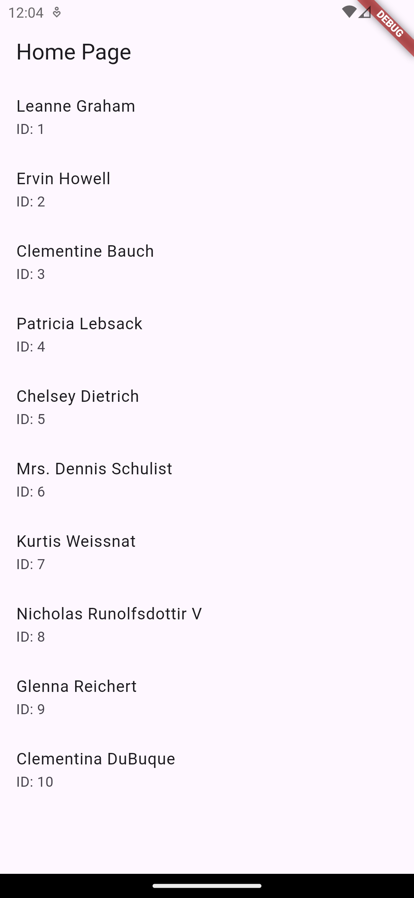

# Flutter Technical Test

## Descripción

Esta aplicación muestra en la página principal un listado de usuarios. El objetivo de la prueba técnica es identificar y corregir errores y buenas prácticas en Flutter y Dart, identificar mejoras en la Arquitectura, e implementar el caso de uso de detalle de usuario.

Para los hallazgos encontrados o recomendaciones planteadas, puedes realizar el refactoring que consideres necesario y justificar tu planteamiento como en el siguiente ejemplo. Los ajustes realizados debes subirlos a una rama de git llamada prueba-tecnica.

```dart
// TODO: El nombre de la función g no es descriptivo y no indica lo que hace la función
- int g(int a, int b) {
+ int SumaDosNumeros(int number1, int number2) {
  return number1 + number2;
}
```

## Caso de Uso: Detalle de Usuario

| Título          | Ver Detalle del Usuario                                                                                                          |
| --------------- | -------------------------------------------------------------------------------------------------------------------------------- |
| **Actores**     | Usuario                                                                                                                          |
| **Descripción** | Yo, como usuario, quiero hacer clic en el listado de usuarios y ver el nombre de usuario, teléfono, correo electrónico y ciudad. |

## Home


```
